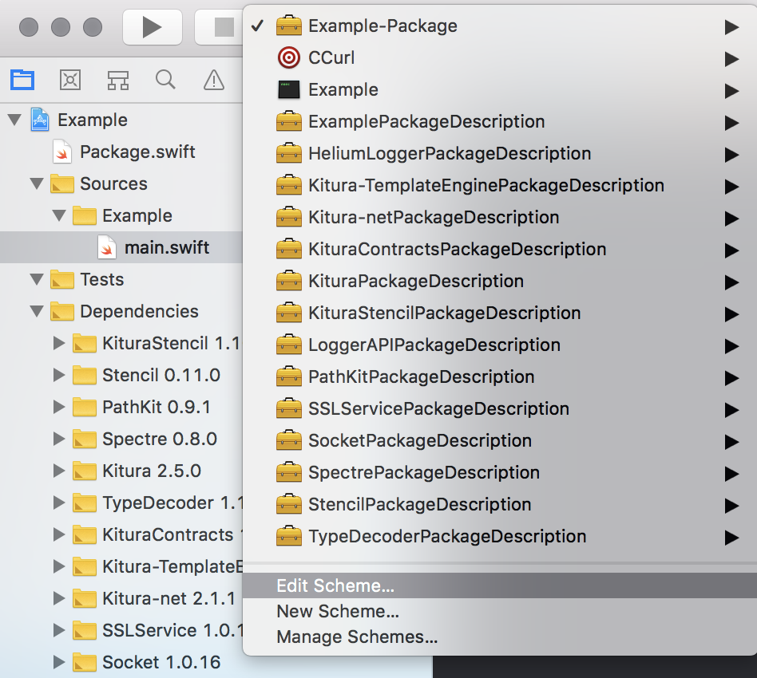
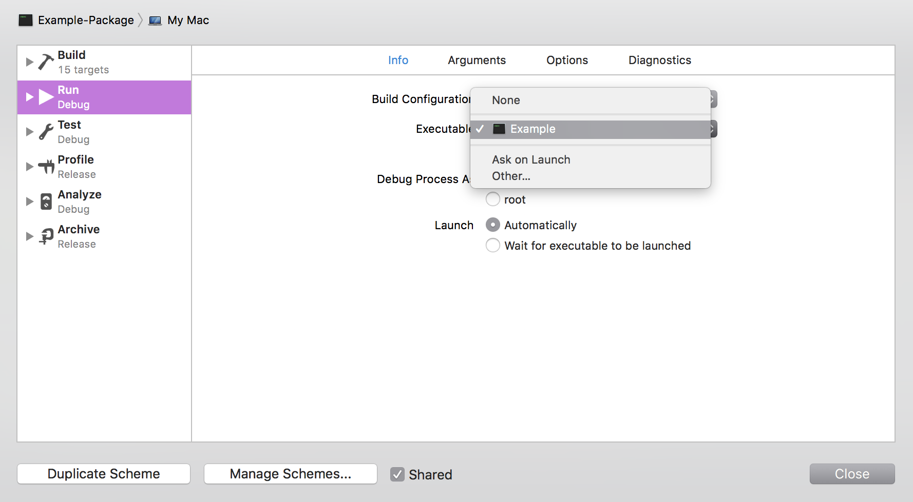
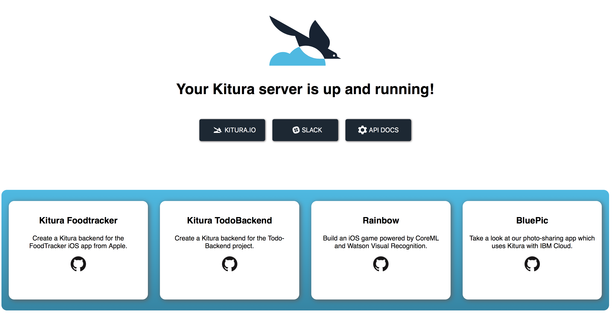
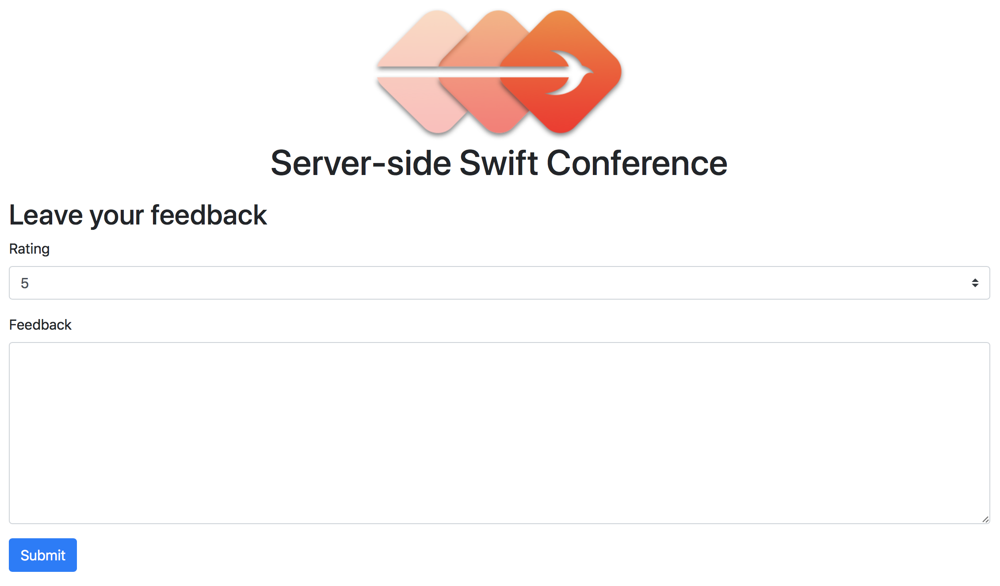
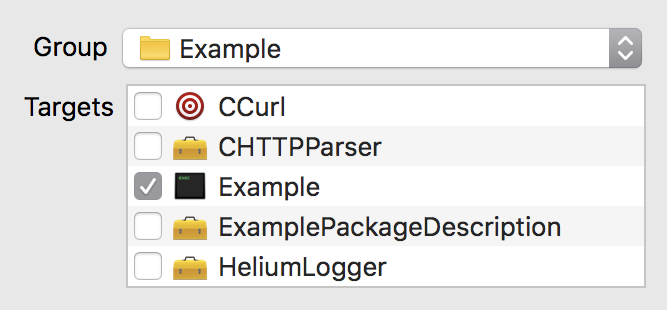

# Server-side web apps with Kitura and Stencil

This repository contains the materials for the "Server-side web apps with Kitura and Stencil" workshop from the 2018 server-side Swift conference.

Included is an **Example** project that demonstrates the basics features you should master before starting your own project.

This README covers the steps taken to build the **Example** project.

## Prerequisites

You need to have Swift 4.1 or higher installed. On macOS, use either Xcode 9.4 or Xcode 10; on Linux, use an editor of your choice.

To edit Stencil files, I recommend you install [Visual Studio Code](https://code.visualstudio.com) and [my extension](https://marketplace.visualstudio.com/items?itemName=svanimpe.stencil) that adds syntax highlighting, autocompletion, snippets and indentation support for Stencil. 

Enable the extension by adding the following to Visual Studio Code's **settings.json**:

```json
"files.associations": {
  "*.stencil": "stencil-html"
},
```

Without this setting, you'll need to use the **.html.stencil** extension instead.

## Part I: The basics

This section introduces you to the basics of setting up a server-side Swift project and Kitura server.

### Creating a project

Use the Swift Package Manager to create an empty project:

```none
mkdir Example
cd Example
swift package init --type executable
```

Next, edit **Package.swift** to add Kitura and Stencil as dependencies:

```swift
let package = Package(
  name: "Example",
  dependencies: [
    .package(url: "https://github.com/IBM-Swift/HeliumLogger.git", .upToNextMinor(from: "1.7.0")),
    .package(url: "https://github.com/IBM-Swift/Kitura.git", .upToNextMinor(from: "2.5.0")),
    .package(url: "https://github.com/IBM-Swift/Kitura-StencilTemplateEngine.git", .upToNextMinor(from: "1.10.0")),
  ],
  targets: [
    .target(
      name: "Example",
      dependencies: ["HeliumLogger", "Kitura", "KituraStencil"]),
  ]
)
```

You can run the app with:

```none
swift run
```

It should print `"Hello, world!"`.

### Creating an Xcode project

If you'd like to use Xcode, create an Xcode project with:

```none
swift package generate-xcodeproj
```

Unfortunately, Xcode doesn't (yet) support Swift Package Manager, so you'll have to regenerate the Xcode project every time you change **Package.swift**.

After opening the project and before making any changes to the code, first build the project. This makes sure the dependencies are built and available to import.

Now edit the current scheme:



And set the executable:



You should now be able to run the app from Xcode.

### Starting Kitura

In **main.swift**, add the following to create a basic Kitura server:

```swift
import Foundation
import HeliumLogger
import Kitura
import KituraStencil

let router = Router()

HeliumLogger.use()
Kitura.addHTTPServer(onPort: 8080, with: router)
Kitura.run()
```

Start the server and verify it's running by connecting to [http://localhost:8080](http://localhost:8080). You should be greeted by Kitura's welcome page:



### Adding a route

Add your first route:

```swift
router.get("hello") {
  request, response, next in
  response.send("Hello")
  next()
}
```

This route doesn't do much; it returns a `200 OK` response with `Hello` in the body.

As you can see, routes are created by registering route handlers on the `router` object. A route is attached to an endpoint, in this case `/hello`. The handler is a function or closure that takes three parameters:

- The current `request`, from which you can read data.
- The current `response`, which you can configure.
- The `next` handler in the chain. Multiple handlers can be registered for a single endpoint.

When you're done configuring the response, call `next`. However, you should not call `next` when:

- An error is thrown. In this case, Kitura will skip ahead to an error handler.
- You call `end` on the response to complete it.
- You redirect the response to a different endpoint.

Note that you don't have to configure the entire response. Kitura selects an appropriate response code and also sets some headers for you.

## Part II: Building an app

Now that you know the basics, you can leave Hello World behind and build a real app. In this section, you'll grow your project into a feedback page for the conference:



### Domain

Add the following model type to represent a user's feedback:

```swift
import Foundation

struct Feedback {

  let date: Date
  let rating: Int
  let comment: String
}
```

When creating a new file in Xcode, make sure you're adding it to the correct target:



### Persistence

This workshop doesn't cover persistence as there are many different databases out there, each with their own drivers and API. See the resources at the end of this document if you're interested in exploring some of them.

For this project, create a `Persistence` class to mock a database:

```swift
class Persistence {
 
  private var feedback: [Feedback] = []

  func getAllFeedback() -> [Feedback] {
    return feedback.sorted { $0.date.compare($1.date) == .orderedDescending }
  }

  func add(_ feedback: Feedback) {
    self.feedback.append(feedback)
  }
}
```

You'll use this class in your route handlers. Create an instance of it in **main.swift**:

```swift
let persistence = Persistence()
```

It is best practice to encapsulate database operations in a persistence layer, and not access the database directly from a route handler. Use layers, winter is coming!

### Templates

You'll use the Stencil templating language to create HTML templates. 

Templates can contain `{{ variables }}`. You'll pass a **rendering context** to Stencil to assign values to these variables.

Templates can also contain `` that add logic and structure:
- `` conditionally includes content.
- `` automates repeating content.
- `` and `` support template inheritance hierarchies.
- `` supports template composition.

Templates go in the **Views** directory. Create this directory and add **base.stencil**:

```django
<!DOCTYPE html>
<html lang="en">
<head>
  <title>Server-side Swift Conference - </title>
  <meta charset="utf-8">
  <meta name="viewport" content="width=device-width, initial-scale=1, shrink-to-fit=no">
  <link href="/public/css/bootstrap.min.css" rel="stylesheet">
  <link href="/public/css/font-awesome.min.css" rel="stylesheet">
</head>
<body>
  <div class="container">
    
  </div>
  <script src="/public/js/jquery.min.js"></script>
  <script src="/public/js/popper.min.js"></script>
  <script src="/public/js/bootstrap.min.js"></script>
</body>
</html>
```

This template defines the structure of a page. You'll use it as a parent template.

The `` tags provide customization points where child templates can insert content.

This template references style sheets and scripts from the **public** directory. Copy this directory from the repository to your project.

Next, add **feedback.stencil**:

```django


Feedback


  <div class="text-center my-3">
    
    <h1>Server-side Swift Conference</h1>
  </div>
  <h2>Leave your feedback</h2>
  <form method="post" action="feedback">
    <div class="form-group">
      <label>Rating</label>
      <select class="form-control custom-select" name="rating">
        <option value="1">1</option>
        <option value="2">2</option>
        <option value="3">3</option>
        <option value="4">4</option>
        <option value="5" selected>5</option>
      </select>
    </div>
    <div class="form-group">
      <label>Feedback</label>
      <textarea class="form-control" name="comment" rows="8"></textarea>
    </div>
    <div class="form-group">
      <button class="btn btn-primary" type="submit">Submit</button>
    </div>
    
      <div class="alert alert-success">
        Thanks for your feedback!
      </div>
    
  </form>
  <h2>Feedback from other users</h2>
  
    <p>
      <span class="text-muted">{{ feedback.date }}</span><br>
      
        {{ feedback.comment }}<br>
      
      Rating: {{ feedback.rating }}
    </p>
  
  <p class="small text-muted">
    Number of ratings: {{ numberOfRatings }}<br>
    Average rating: {{ averageRating }}
  </p>

```

The `` tag declares this template a child of **base.stencil**. As such, it inherits all of its parent's content.

The `` tags are present here as well, this time defining the content that should be inserted.

Note how the second `` tag checks if `feedback.comment` is a non-empty string. The `` tag can check if a variable is present in the context and if that variable is `true`, a strictly positive number, a non-empty string or a non-empty collection.

### Rendering

Before you can render **feedback.stencil**, you need to build a rendering context for all variables used in this template:

- `showConfirmation`
- `feedback`
- `numberOfRatings`
- `averageRating`

`feedback` should be a collection of subcontexts and every element of `feedback` should include:

- `date`
- `comment`
- `rating`

Stencil expects a dictionary of type `[String: Any]` as a rendering context. You could build this dictionary by hand, but that would be both tedious and error-prone. Instead, you'll build a **view model** to represent this context in a type-safe way.

Here's what this view model looks like:

```swift
import Foundation

struct FeedbackPageViewModel: Codable {
  
  let showConfirmation: Bool
  
  struct FeedbackViewModel: Codable {
    
    let date: String
    let rating: Int
    let comment: String
    
    init(_ feedback: Feedback) {
      let formatter = DateFormatter()
      formatter.dateStyle = .short
      formatter.timeStyle = .none
      self.date = formatter.string(from: feedback.date)
      self.rating = feedback.rating
      self.comment = feedback.comment
    }
  }
  let feedback: [FeedbackViewModel]
  
  let numberOfRatings: Int
  let averageRating: Double
  
  init(_ feedback: [Feedback], showConfirmation: Bool) {
    self.showConfirmation = showConfirmation
    self.feedback = feedback.map(FeedbackViewModel.init)
    numberOfRatings = feedback.count
    if numberOfRatings > 0 {
      let totalRating = feedback.map { $0.rating }.reduce(0, +)
      // Keep only two digits after the decimal point.
      averageRating = Double(totalRating * 100 / numberOfRatings) / 100 
    } else {
      averageRating = 0
    }
  }
}
```

View models leverage `Codable`. Kitura encodes view models to dictionaries before passing them to Stencil. The view model's properties should match the variables used in the template, otherwise a custom `CodingKeys` is required.

All the pieces are now in place to implement the route handler.

First, register Stencil with Kitura:

```swift
router.setDefault(templateEngine: StencilTemplateEngine())
```

Kitura supports different template engines and doesn't impose a default. This code not only registers Stencil but also sets it as the default template engine. As a result, a default file extension of **.stencil** is assumed.

Next, register a static file server:

```swift
router.all("public", middleware: StaticFileServer())
```

This serves the images, style sheets and scripts in the **public** directory at the `/public` endpoint, so you don't have to create routes for each of these files.

Finally, add the following route:

```swift
router.get("feedback") {
  request, response, next in
  let feedback = persistence.getAllFeedback()
  let viewModel = FeedbackPageViewModel(feedback, showConfirmation: false)
  try response.render("feedback", with: viewModel)
  next()
}
```

This code is almost trivial. It fetches the existing feedback from the persistence layer, builds a view model, and renders the **feedback.stencil** template.

You should aim to keep your route handlers as simple as possible. Offload complexity to other, reusable components, such as a persistence layer or a view model.

Test out this route by pointing your browser to [http://localhost:8080/feedback](http://localhost:8080/feedback). You should see the page rendered properly, though it won't show any feedback and the form won't work.

### Form handling

Forms arrive at the server as a dictionary of type `[String: String]`. You could parse these dictionaries by hand, but that would be tedious and error-prone. You'll leverage `Codable` again to handle forms in a type-safe way.

Add the following type to represent the form:

```swift
struct FeedbackForm: Codable {
  
  let rating: Int
  let comment: String
  
  var isValid: Bool {
    return 1...5 ~= rating
  }
}
```

This type has `rating` and `comment` properties to match the form fields of the same name. An `isValid` property provides basic validation.

The form is submitted by a POST request to the `/feedback` endpoint. You currently only handle GET requests on this endpoint, so you'll need to add a new handler:

```swift
router.post("feedback") {
  request, response, next in
  guard let form = try? request.read(as: FeedbackForm.self),
        form.isValid else {
    response.status(.badRequest)
    return next()
  }
  let newFeedback = Feedback(date: Date(),
                             rating: form.rating,
                             comment: form.comment)
  persistence.add(newFeedback)
  try response.render("feedback", with: FeedbackPageViewModel(
    persistence.getAllFeedback(),
    showConfirmation: true))
  next()
}
```

When decoding the form, an error is thrown if a required field is missing or a field is of the wrong type. This error is caught by the `guard` statement and results in a **400 Bad Request** response.

You should now be able to submit the form and see the feedback appear.

Congratulations on building your first server-side web app with Swift!

## Part III: Build your own app

Don't stop here! Apply what you've learned and try to build an app of your own.

Consult the resources below if you get stuck or are looking for something that isn't covered in the example.

If you'd like to share your work with the other attendees, contact me and I'll add a link here.

## Resources

- [Kitura](https://www.kitura.io).
- [Stencil](https://github.com/stencilproject/Stencil).
- [Postman](https://www.getpostman.com) is a helpful tool to send and debug requests.
- [Swift Blog](https://github.com/svanimpe/swift-blog) is the source code for my personal website and blog. It's a small and approachable project and contains instructions on how to deploy to IBM Cloud.
- [Around The Table](https://github.com/svanimpe/around-the-table) is a platform that supports tabletop gaming communities. It goes way beyond what we've covered today and is the topic of my talk on Friday.

If you're looking for SQL storage, have a look at Kitura's [Kuery](https://github.com/IBM-Swift/Swift-Kuery) and [Kuery ORM](https://github.com/IBM-Swift/Swift-Kuery-ORM) frameworks.

If NoSQL is what you need, check out Kitura's [CouchDB](https://github.com/IBM-Swift/Kitura-CouchDB) driver. For MongoDB, use [MongoKitten](https://github.com/OpenKitten/MongoKitten) or MongoDB's new [official driver](https://github.com/mongodb/mongo-swift-driver).

## Show your support

If you enjoyed the workshop and want to support my open source work, please consider <a href="https://www.patreon.com/svanimpe">becoming a patron</a>.
